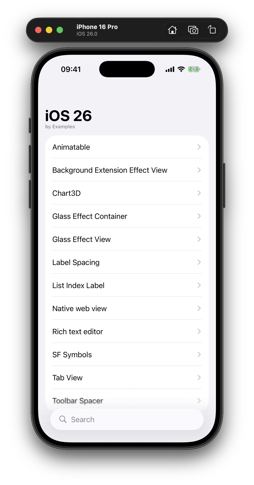

# iOS 26 by Examples

A collection of hands-on examples demonstrating new features and APIs introduced in iOS 26, built with SwiftUI. Each example is self-contained and showcases a specific capability or UI enhancement available in the latest iOS release.

## Examples

- **[AnimatableView](iOS-26-by-Examples/Views/AnimatableView.swift)**: Demonstrates custom animatable shapes and interactive animation using SwiftUI's new `@Animatable` macro.
- **[BackgroundExtensionEffectView](iOS-26-by-Examples/Views/BackgroundExtensionEffectView.swift)**: Shows how to use the new `.backgroundExtensionEffect()` modifier for immersive backgrounds.
- **[Chart3DView](iOS-26-by-Examples/Views/Chart3DView.swift)**: Explores the new 3D charting capabilities with `Chart3D` and `SurfacePlot`.
- **[GlassEffectContainerView](iOS-26-by-Examples/Views/GlassEffectContainerView.swift)**: Showcases advanced glassmorphism effects and container unions using `GlassEffectContainer` and related APIs.
- **[GlassEffectView](iOS-26-by-Examples/Views/GlassEffectView.swift)**: Demonstrates the new GlassEffect API for creating translucent, glass-like UI elements.
- **[LabelSpacingView](iOS-26-by-Examples/Views/LabelSpacingView.swift)**: Demonstrates new label spacing and icon width customization with `.labelIconToTitleSpacing` and `.labelReservedIconWidth`.
- **[ListSectionIndexLabel](iOS-26-by-Examples/Views/ListSectionIndexLabel.swift)**: Uses `.sectionIndexLabel` and `.listSectionIndexVisibility` for improved list navigation.
- **[NativeWebView](iOS-26-by-Examples/Views/NativeWebView.swift)**: Integrates a native `WebView` with SwiftUI, loading a web page on appear.
- **[NewTabView](iOS-26-by-Examples/Views/NewTabView.swift)**: Presents the enhanced `TabView` with new tab roles, bottom accessories, and minimize behavior.
- **[RichTextEditor](iOS-26-by-Examples/Views/RichTextEditor.swift)**: Utilizes the improved `TextEditor` for rich text editing with attributed strings.
- **[SFSymbolsView](iOS-26-by-Examples/Views/SFSymbolsView.swift)**: Animates and customizes SF Symbols with new symbol effects and variable values.
- **[ToolbarSpacerView](iOS-26-by-Examples/Views/ToolbarSpacerView.swift)**: Demonstrates the new toolbar spacer API for flexible and adaptive toolbar layouts.

## Contributing

Contributions are welcome! If you have an example, improvement, or fix to share, feel free to open a pull request or submit an issue. Please ensure your code follows the style of the existing examples.

## Author

Artem Novichkov, https://www.artemnovichkov.com/

## License

The project is available under the MIT license. See the [LICENSE](./LICENSE) file for more info.